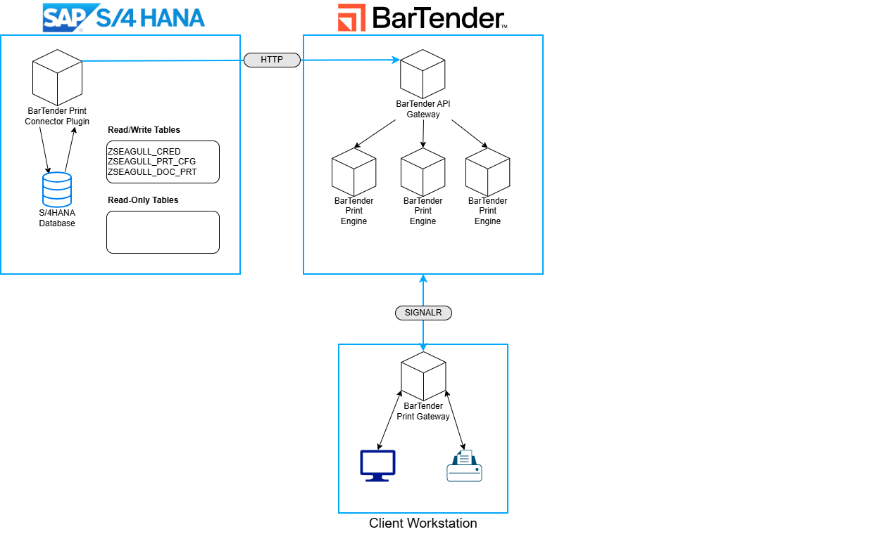

# Integrating BarTender Cloud with SAP S/4HANA Cloud

## Description

This plugin is designed to allow customers to print.

This integration showcases:

- Querying data from S/4HANA Cloud CDS views
- Serializing data to JSON format
- Querying BarTender Cloud APIs for eligible printers
- Querying BarTender Cloud APIs for available BarTender label templates
- Submitting print jobs to BarTender Cloud REST APIs with data from S/4HANA in response to SAP business events
- Submitting print jobs to Bartender Cloud REST APIs in response to manual user requests

## Architecture

### Architecture Diagram

The BarTender Print Connector for S/4HANA Cloud application is developed in ABAP within the Eclipse IDE and runs on SAP S/4HANA Public Cloud. The application queries SAP CDS views and uses BarTender Cloud REST APIs to submit print jobs with data from the S/4HANA Cloud system.

## Requirements

- SAP S/4HANA Public Cloud system

### For local development you will require the following:

- A Git platform
- [Eclipse IDE with ABAP Development Tools (ADT)](https://developers.sap.com/tutorials/abap-install-adt..html)

## Installation

### Step 1: [Importing the Plugin Code](/documentation/importing_code.md)

### Step 2: [Configuring the Plugin](/documentation/configuring_plugin.md)

### Step 3: [Extending the Code](/documentation/extending_code.md)

## Known Issues

- Label Format and Printer selection dialogs are limited to 500 records. If your tenant has more than 500 label formats or printers, they may not display in the dialogs.
- BarTender Cloud endpoint URL is hard-coded in the ABAP class in 3 locations.

## How to Obtain Support

If you find a bug or you need additional support, please [contact support](https://support.seagullsoftware.com/hc/en-us) on Seagull's Support Portal.
